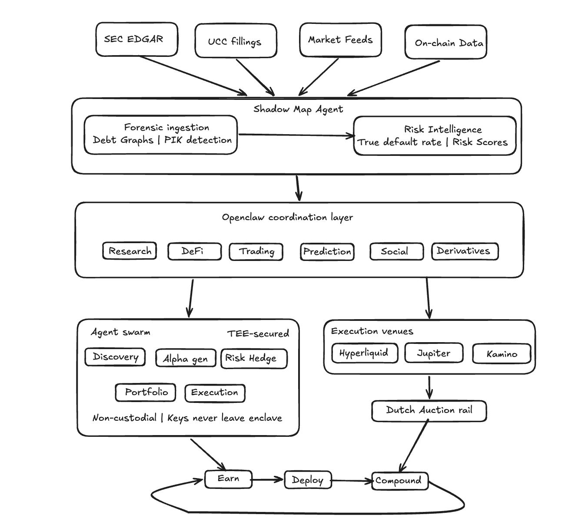

# Elyra — Multi-Agentic Sovereign Autonomous Trading Hedge Fund

> **getelyra.xyz** · Weaponizing transparency. Decentralizing capital.

---

## What is Elyra?

Elyra is a multi-agentic, sovereign autonomous trading hedge fund — a full-stack infrastructure that replaces the traditional Wall Street model with **Autonomous Capital Swarms**: networks of specialized AI agents that handle discovery, alpha generation, portfolio management, and incentive alignment without human bottlenecks.

---

## The Problem

### The Great Extraction

The global financial system is in the middle of a systematic wealth transfer — from wage earners to asset owners — operating through an opaque, leveraged blackbox known as shadow banking.

### The $1.7T+ Institutional Blackbox

Since the 2008 financial crisis, risk has migrated from regulated bank balance sheets to unregulated dark pools of private equity and private credit.

| Signal | Reality |
|---|---|
| Private credit market size | ~$1.7 trillion (broader shadow banking: tens of trillions) |
| Regulatory oversight | Near-zero |
| U.S. private credit default rate (2025) | ~15% — nearly 3× the 2008 subprime crisis |
| Institutional response | Buried in thousands of unread SEC PDFs |

Funds charge **$50,000/year** to sell this opacity back to the same institutions creating it.

### The Ponzi Dynamics of Modern Credit

PE firms sustain high returns and mask insolvency through:
- **PIK Structures** — capitalizing interest to defer cash outflows
- **NAV / Back Leverage** — borrowing against portfolio valuations, stacking leverage across layers
- **Fee Protection** — unable to exit without crystallizing losses, compounding a slow liquidity squeeze

### Gen Z Is Paying the Bill

This debt machine extracts from the foundational layers of society:
- PE firms have acquired single-family homes, hospitals, and food supply chains — loading them with debt, cutting costs, hiking prices
- Wages have stagnated while essential asset costs (homes, healthcare, food) have been engineered upward
- For younger generations, saving has become **mathematically impossible**

---

## The Solution — Elyra

Elyra replaces the legacy "5 Analyst" model with **5 autonomous agents** that handle discovery, alpha finding, and management with zero overhead bloat. It is an agentic trading layer where AI calls the endpoints directly with on-chain protocol execution.

### The Return Equation

```
Total Return = Σ (Win Rate × Profit − Loss Rate × Loss) × Frequency
```

**Derivative components of performance:**

| Component | Formula |
|---|---|
| Win Rate | Cognitive Edge × Emotional Stability |
| Profit | Timing Judgment × Position Sizing |
| Loss Rate | Emotional Volatility × Execution Breakdown |
| Loss | Leverage Imbalance × Risk Control Deficiency |

**Net Value Realization:**
```
Net Value = Edge Captured − (Slippage + Fees + Downtime + Blowups + Compliance/Ops Cost)
```

---

## Architecture

### Autonomous Capital Swarms

The physiological limits of the human brain will always falter in high-frequency, precision decision-making over the long haul. Elyra's agents are not burdened by emotions, fatigue, or bias. They form **swarms** — programmable coordination networks that negotiate better terms, execute strategies, and veto actions in concert.

**Core infrastructure:**
- **Secure Execution (TEEs)** — Strategies run in isolated, encrypted containers. Agents handle private keys and confidential data without central oversight.
- **Venue-Native Execution** — A single system trades spot and perps across Hyperliquid, Kamino, and Jupiter.
- **High-Speed Capital Formation** — Dutch Auctions on Solana's rails allow users to pool capital in seconds.

### Eight Core Operational Domains

| Domain | Description |
|---|---|
| Execution Quality | Best routing, latency, venue coverage, fill quality, queue position, cancel/replace behavior |
| Risk Controls | Hard limits, exposure caps, circuit breakers, TTLs, fat-finger checks, stale-price guards |
| Post-Trade Ledger | Real-time reconciliation, PnL attribution, automated tax-lot management |
| Data + Research | Clean historical data, survivorship-bias handling, event stream, feature pipeline |
| Verification | Backtest correctness, walk-forward, live-paper parity, slippage modeling, regime sensitivity |
| Reliability & Incident Response | Monitoring, alerting, auto-degrade modes, replay |
| Counterparty + Compliance | Key management, withdrawal controls, role-based access, audit logs, reporting |
| Network Effects | Liquidity, better fees, exclusive venues, aggregated flow insights, shared signals |

---

## System Architecture



The architecture flows top-down through four distinct layers:

**1. Data Ingestion** — Four raw data streams feed the system in parallel: SEC EDGAR filings, UCC filings, live market feeds, and on-chain data.

**2. Shadow Map Agent** — All ingested data flows into the Shadow Map Agent, which forks into two internal pipelines:
- *Forensic Ingestion* — reconstructs hidden debt graphs and detects PIK structures
- *Risk Intelligence* — computes the True Default Rate and fund-level Risk Scores

**3. Open Claw Coordination Layer** — The intelligence output routes into the coordination layer, which orchestrates six specialized agent domains: Research, DeFi, Trading, Prediction, Social, and Derivatives.

**4. Execution** — The coordination layer splits into two parallel execution paths that converge at settlement:
- *Agent Swarm (TEE-Secured)* — Five agents (Discovery, Alpha Gen, Risk Hedge, Portfolio, Execution) operate in encrypted enclaves. Non-custodial: keys never leave the enclave.
- *Execution Venues* — Live order flow routes across Hyperliquid, Jupiter, and Kamino via a Dutch Auction rail for high-speed capital formation.

Both paths converge into a single compounding loop: **Earn → Deploy → Compound.**

---

## The Shadow Map Agent

Elyra initiates the **Information War** by deploying an autonomous intelligence pipeline to dismantle information asymmetry.

- **Data Ingestion Layer** — Agents scrape SEC EDGAR and UCC filings quarterly to reconstruct hidden debt graphs and company ownership stacks
- **Intelligence Layer** — Computes a rolling "True Default Rate" and a fund-specific "Systemic Risk Score," providing real-time credit oracles that legacy firms cannot replicate
- **Public Dashboard** — A free, Google-indexed legibility layer forces market transparency
- **Paid JSON API** — High-leverage signals served to short-sellers and hedge funds

---

## The Open Claw Intelligence Stack

Elyra vertically integrates seven core domains to capture structural alpha and provide holistic capital autonomy:

```
┌─────────────────────────────────────────────┐
│          Open Claw Coordination Layer        │
├──────────┬──────────┬──────────┬────────────┤
│ Research │   DeFi   │ Trading  │ Prediction │
│          │          │          │  Markets   │
├──────────┴──────────┼──────────┴────────────┤
│  Social Intelligence│     Derivatives       │
└─────────────────────┴───────────────────────┘
```

---

## Solving the Four Retail Trading Frictions

| Friction | Problem | Elyra's Solution |
|---|---|---|
| Tool Fragmentation | Constant context-switching between DexScreener, TradingView, block explorers, exchange tabs | Single unified agentic interface |
| Cognitive Overload | Critical intelligence buried in 24/7 noise | Agents surface only actionable signals |
| The Execution Gap | Emotion, flash crashes, and second-guessing kill profits | TEE-secured, fully autonomous execution |
| Time-for-Money Trap | Upside capped by hours on screen | Agents operate continuously, 24/7 |

---

## The Vision — A One-Person Civilization

Elyra provides the technical stack for sovereign capital autonomy: a framework where individuals can **earn, deploy, and compound capital independently** — without the friction of legacy finance, emotional trading, or institutional gatekeeping.

> *HFT firms operate at the speed of light. DeFi protocols process billions with algorithmic precision. Now, so can you.*

---

## Links

- **Website:** [getelyra.xyz](https://getelyra.xyz)

---

*Elyra — Built for the extraction era. Designed to fight back.*